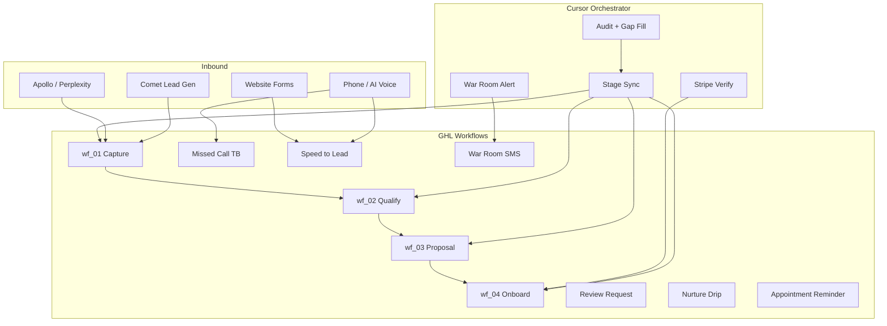

# GHL Workflow Analysis — Flux Labs Master Template

**Date:** 2026-06-26  
**Status:** Workflows complete per leadership. AI Voice config in progress.  
**Registry:** `config/ghl-workflows-registry.json`

---

## Executive Summary

Your GHL stack is a **4-layer automation machine**:

| Layer | Count | Owner | Cursor Role |
|-------|-------|-------|-------------|
| Revenue Pipeline | 4 workflows | GHL stage triggers | Set stage only |
| Operations | 5+ workflows | GHL always-on | None |
| Internal | 1 workflow | GHL tag trigger | Tag ping for SMS |
| AI Voice | In config | GHL + Voice AI | Log + route only |

**Golden rule:** Cursor moves data and stages. GHL talks to humans.

---

## Layer 1 — Revenue Pipeline (The Money Machine)

These fire automatically when pipeline stage changes. **Never enroll via Zapier.**

```
New Lead ──→ wf_01_capture ──→ welcome + intake
Qualified ──→ wf_02_qualify ──→ discovery + trial offer
Proposal Sent ──→ wf_03_proposal ──→ pitch + Stripe link
Contract Signed ──→ wf_04_onboard ──→ payment welcome + delivery kickoff
```

| ID | Workflow | Trigger | What It Does | Current State |
|----|----------|---------|--------------|---------------|
| `workflow_6ac22c41...` | 01 Capture | New Lead | Welcome SMS/email, intake fields, speed-to-lead | ✅ Fired on 6 enriched leads |
| `workflow_adcb0b97...` | 02 Qualify | Qualified | Discovery, score gate (75+), trial sequences | ✅ Ready |
| `workflow_d9b0da17...` | 03 Proposal | Proposal Sent | Pitch cadence, Stripe payment delivery | 🔥 **ACTIVE on 5 deals** |
| `workflow_dbf4fd0b...` | 04 Onboard | Contract Signed | Intake forms, delivery handoff | ✅ Proven on FLA-2026-101 |

### Active Pipeline (Hands Off)

| Ref | Company | Workflow Running |
|-----|---------|------------------|
| FLA-2026-102 | Jacquin & Sons | wf_03 |
| FLA-2026-103 | Rooftop Roofing | wf_03 |
| FLA-2026-104 | Complete Air & Heat | wf_03 |
| FLA-2026-105 | Fitzpatrick Plumbing | wf_03 |
| FLA-2026-106 | Packard Roofing | wf_03 |

**Cursor watches Stripe every 30 min.** On payment → `verify_close` → Contract Signed → wf_04 fires.

---

## Layer 2 — Operations (Flux Ops Deliverables)

From master knowledge file — bundled in client retainers:

| Workflow | Flux Ops Tier | Trigger | Business Value |
|----------|---------------|---------|----------------|
| Missed Call Text-Back | Starter+ | Missed call | `workflow_ccbef0e2...` — recovers after-hours leads |
| Speed-to-Lead | Growth+ | Form/chat/inbound | Sub-60s response — closes speed gap |
| Review Request | Growth+ | Post-job / scheduled | GBP ranking + social proof |
| Lead Nurture Drip | Growth+ | Non-responsive leads | Long-cycle revenue recovery |
| Appointment Reminder | Growth+ | Calendar booked | No-show reduction |

These run **independently of pipeline stage** — they're always-on for active Flux Ops clients.

---

## Layer 3 — Internal (War Room)

| Workflow | Trigger | Recipients | Status |
|----------|---------|------------|--------|
| War Room SMS Alert | Tag `war_room_alert_ping` | Jonathan + Heaven | ✅ Live |

**How it fires:** `war-room-alert` skill tags both internal GHL contacts → each gets SMS → tag removed.

**Events that trigger SMS:**
- Deal closed / payment received
- Proposal pitched
- Daily digest (6 AM)
- 48h unpaid follow-up
- Client fulfillment gaps
- Critical system alerts

---

## Layer 4 — AI Voice (In Configuration)

### What It Should Do

Per master knowledge file (sections 8–9), the AI voice agent is **not a voicemail taker** — it's the front door:

1. **Welcome** — "Thank you for calling Flux Labs Agency..."
2. **Identify need** — web, SEO, GBP, leads, Brand Fusion, existing client
3. **Route accurately** — per routing table below
4. **Log everything** — GHL contact update + tags + call summary
5. **Escalate live issues** — urgent flag + War Room SMS

### Routing Table (Wire Into Voice Config)

| Caller Intent | Route To | GHL Action |
|---------------|----------|------------|
| New prospect (general) | Sales / booking link | Tag + wf_01 or speed-to-lead |
| Brand Fusion inquiry | Brand Fusion discovery | Tag `brand-fusion-client` |
| Existing client — project | Heaven Yeager | Internal task + note |
| Billing / invoice | Heaven Yeager | Tag + notify |
| Contract / pricing negotiation | Jonathan | Tag `Callback Requested` |
| Complaint / escalation | Jonathan urgent | `war_room_alert_ping` + urgent task |
| Technical / website support | Heaven Yeager | Task + note |
| Press / partnership | Jonathan | Tag + callback |
| Flux Ops waitlist interest | Nurture | Tag `flux-ops-waitlist` |

### Voice → Workflow Integration Points

```
Inbound Call
    │
    ├─ Answered by AI Voice
    │     ├─ Create/update GHL contact
    │     ├─ Log call summary custom field
    │     └─ Tag intent (Callback Requested, etc.)
    │
    ├─ Caller hangs up / missed
    │     └─ wf_missed_call (text-back within seconds)
    │
    ├─ Form/chat after call
    │     └─ speed_to_lead workflow
    │
    └─ Urgent escalation
          └─ war_room_alert_ping → SMS Jonathan + Heaven
```

### AI Voice Config Checklist

- [ ] GHL contact created/updated on every call with phone + name
- [ ] Call summary written to contact notes or custom field
- [ ] Intent tags applied (Callback Requested, flux-ops-waitlist, etc.)
- [ ] After-hours → missed call workflow still fires as backup
- [ ] Pricing questions reference June 2026 knowledge file (not legacy Square-only docs)
- [ ] "What does Flux do?" uses approved script from section 8
- [ ] Urgent issues trigger War Room SMS to leadership
- [ ] Existing client lookup by phone/email before generic sales pitch
- [ ] Never promise Flux Ops launch dates
- [ ] Booking link: calendar.app.google/fxRwT82P5GRCY3GR9

### Tone Calibration (Section 14)

| Do | Don't |
|----|-------|
| Warm, direct, neighborly | Robotic, corporate, vague |
| Ask qualifying questions | Overpromise timelines |
| Explain plainly | Quote without scope confirmation |
| Acknowledge pain | Invent ROI numbers |

---

## Architecture Diagram



---

## Gaps & Recommendations

### 1. Capture Missing Workflow IDs
Operations workflow IDs (speed-to-lead, review, nurture, appointment, war room) are not in canonical config yet. Export from GHL → add to `config/ghl-workflows-registry.json`.

### 2. AI Voice → GHL Write Path
Ensure voice platform writes to GHL on every call:
- Phone, name, email (if collected)
- Call summary
- Intent tag
- `ai_qualification_score` if voice qualifies

### 3. Stripe Metadata Sync
wf_03 delivers Stripe links. Confirm all pitched deals have `fla_contract_ref` on Stripe metadata matching GHL.

### 4. Knowledge File Billing Line
Master file still says Square Invoice. Website + deal machine use **Stripe**. Update GHL AI knowledge to match.

### 5. Do Not Duplicate
| System | Owns |
|--------|------|
| Comet | Lead gen, browser |
| GHL | All customer SMS/email/voice follow-up |
| Website | Stripe checkout |
| Cursor | Audit, stage sync, verify close, War Room reports |

---

## Health Check Commands

```
Run deal-orchestrator digest → #war-room
Run deal-orchestrator verify_close for FLA-2026-102 through 106
Run war-room-alert for war_room_system with message "GHL workflow analysis complete"
```

---

## Next Step for AI Voice

Wire the voice agent's **post-call webhook** to:
1. GHL contact upsert (phone required)
2. Tag by intent
3. If urgent → `war_room_alert_ping` on internal contacts
4. If new lead → ensure pipeline opportunity at New Lead (wf_01 fires)

This completes the loop: **Voice answers → GHL logs → Workflows nurture → Cursor watches payments → War Room alerts leadership.**
